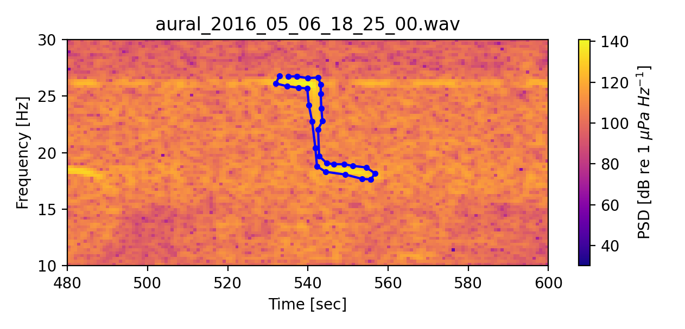
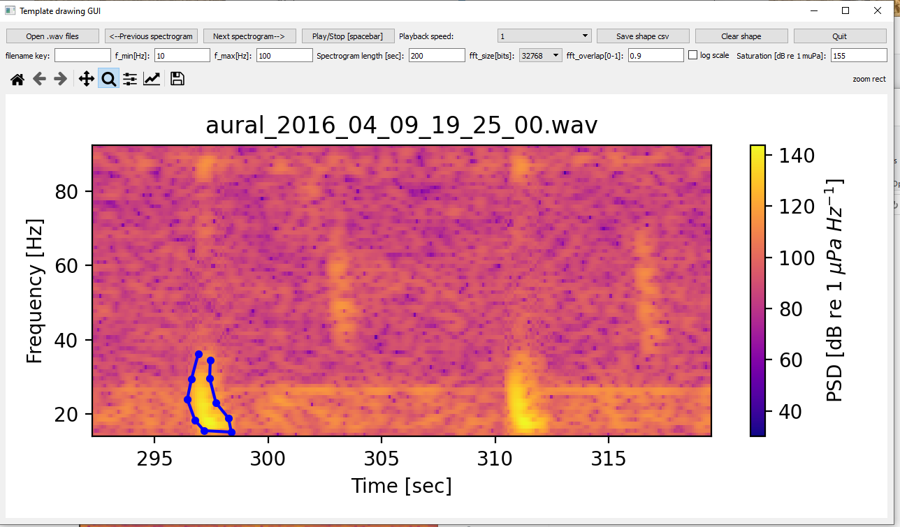
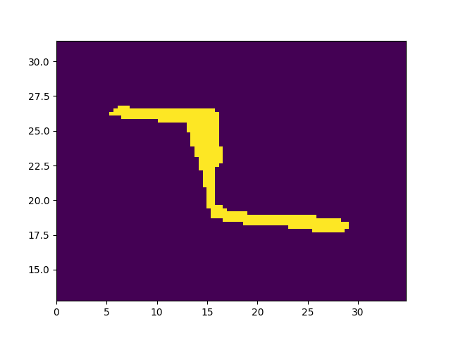
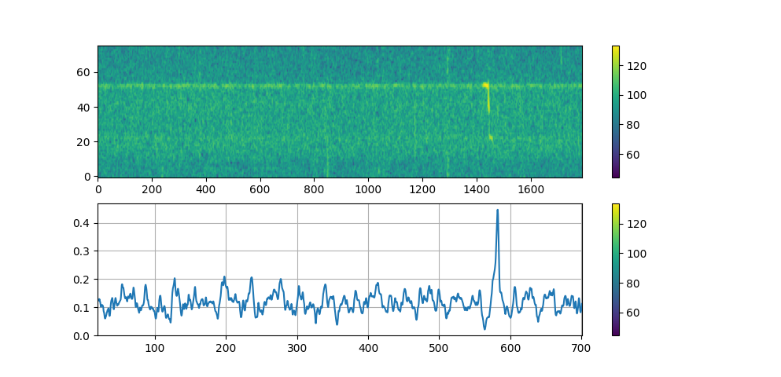
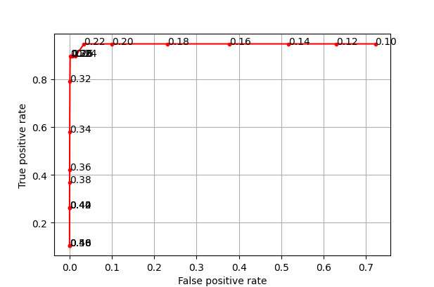

# Spectrogram correlation tutorial

This method uses 2-D template matching to detect a sound signal. The first step is to convert the sound signal into a spectrogram (2-d image) with suitable resolution. Than we need to define a template (also called a kernel) and slide it over the spectrogram to calculate the correlation score (between 0 and 1). All peaks above a certain threshold are than marked as detections. 

## Drawing the template shape based on an example audio file

The following python program (kernel_drawing_gui.py) allows you to open and visualize .wav files as spectrograms. You can than navigate to the signal you would like to use as template and draw its outline. A double-left-click sets a new point and a right-click removes the last point. Draw a polygon around the signal and leave a small gap between the first and last point, python will interpolate the template correctly based on this line. Here is an example where I drew the shape of a blue whale z-call. Once finished you can save the shape as .csv file, where the time in seconds and frequency in Hz determines the shape of the template. 

The full GUI looks like this (here with a fin whale example):



The signal shape .csv file:

|      | Timestamp                  | Frequency          |
| ---- | -------------------------- | ------------------ |
| 0    | 670.04643531 | 25.771276 |
| 1    | 673.1603098585 | 25.7712765  |
| ... | ...            | ... |


```python
# -*- coding: utf-8 -*-
"""
Created on Mon Sep  6 17:28:37 2021

@author: Sebastian Menze, sebastian.menze@gmail.com
"""

import sys
import matplotlib
# matplotlib.use('Qt5Agg')

from PyQt5 import QtCore, QtGui, QtWidgets

# from PyQt5.QtWidgets import QShortcut
# from PyQt5.QtGui import QKeySequence

from matplotlib.backends.backend_qt5agg import FigureCanvasQTAgg, NavigationToolbar2QT as NavigationToolbar
from matplotlib.figure import Figure

import scipy.io.wavfile as wav
from scipy import signal
import numpy as np
from matplotlib import pyplot as plt
import pandas as pd
import datetime as dt
import time
import os
import simpleaudio as sa

class MplCanvas(FigureCanvasQTAgg ):

    def __init__(self, parent=None, width=5, height=4, dpi=100):
        self.fig = Figure(figsize=(width, height), dpi=dpi)
        self.axes = self.fig.add_subplot(111)
        super(MplCanvas, self).__init__(self.fig)

class MainWindow(QtWidgets.QMainWindow):

    def __init__(self, *args, **kwargs):
        super(MainWindow, self).__init__(*args, **kwargs)

        self.canvas =  MplCanvas(self, width=5, height=4, dpi=200)
                
        # self.call_time=pd.Series()
        # self.call_frec=pd.Series()
        
        self.f_min = QtWidgets.QLineEdit(self)
        self.f_min.setText('10')
        self.f_max = QtWidgets.QLineEdit(self)
        self.f_max.setText('16000')
        self.t_length = QtWidgets.QLineEdit(self)
        self.t_length.setText('')
        self.db_saturation=QtWidgets.QLineEdit(self)
        self.db_saturation.setText('155')
        
        # self.fft_size = QtWidgets.QLineEdit(self)
        # self.fft_size.setText('32768')
        self.fft_size = QtWidgets.QComboBox(self)
        self.fft_size.addItem('1024')        
        self.fft_size.addItem('2048')        
        self.fft_size.addItem('4096')        
        self.fft_size.addItem('8192')        
        self.fft_size.addItem('16384')        
        self.fft_size.addItem('32768')        
        self.fft_size.addItem('65536')    
        self.fft_size.addItem('131072')    
        self.fft_size.setCurrentIndex(4)
        
        self.fft_overlap = QtWidgets.QLineEdit(self)
        self.fft_overlap.setText('0.8')
 
        self.filename_timekey = QtWidgets.QLineEdit(self)
        self.filename_timekey.setText('')       
 
        self.playbackspeed = QtWidgets.QComboBox(self)
        self.playbackspeed.addItem('0.5')        
        self.playbackspeed.addItem('1')        
        self.playbackspeed.addItem('2')        
        self.playbackspeed.addItem('5')        
        self.playbackspeed.addItem('10')        
        self.playbackspeed.setCurrentIndex(1)

        self.time= dt.datetime.now()
        self.f=None
        self.t=[-1,-1]
        self.Sxx=None
             
        self.plotwindow_startsecond=0
        # self.plotwindow_length=120
        
        openfilebutton=QtWidgets.QPushButton('Open .wav files')
        def openfilefunc():
            self.filecounter=-1
            self.call_time=pd.Series()
            self.call_frec=pd.Series()            
            self.call_label=pd.Series()    
            self.t_limits=None
            self.f_limits=None

            options = QtWidgets.QFileDialog.Options()
            # options |= QtWidgets.QFileDialog.DontUseNativeDialog
            self.filenames, _ = QtWidgets.QFileDialog.getOpenFileNames(self,"QFileDialog.getOpenFileNames()", r"C:\Users\a5278\Documents\passive_acoustics\detector_delevopment\detector_validation_subset","Wav Files (*.wav)", options=options)
            self.filenames = np.array( self.filenames )
            print(self.filenames)
        openfilebutton.clicked.connect(openfilefunc)
        
        
        def read_wav():
                 
            audiopath=self.filenames[self.filecounter]
      
            if self.filename_timekey.text()=='':
                # self.time= dt.datetime(1,1,1,0,0,0)
                self.time= dt.datetime.now()
            else:     
                self.time= dt.datetime.strptime( audiopath.split('/')[-1], self.filename_timekey.text() )

            self.fs, self.x = wav.read(audiopath)
            print('open new file: '+audiopath)
            
            # factor=60
            # x=signal.decimate(x,factor,ftype='fir')
            
            db_saturation=float( self.db_saturation.text() )
            x=self.x/32767 
            p =np.power(10,(db_saturation/20))*x #convert data.signal to uPa    
            
            fft_size=int( self.fft_size.currentText() )
            fft_overlap=float(  self.fft_overlap.text() )
            self.f, self.t, self.Sxx = signal.spectrogram(p, self.fs, window='hamming',nperseg=fft_size,noverlap=fft_size*fft_overlap)
            # self.t=self.time +  pd.to_timedelta( t  , unit='s')           
            
        def plot_spectrogram():
        
            # self.canvas = MplCanvas(self, width=5, height=4, dpi=100)
            # self.setCentralWidget(self.canvas)
            self.canvas.fig.clf() 
            self.canvas.axes = self.canvas.fig.add_subplot(111)
            # self.canvas.axes.cla()
            
            if self.t_length.text()=='':
                self.plotwindow_length= self.t[-1] 
                self.plotwindow_startsecond=0
            else:    
                self.plotwindow_length=float( self.t_length.text() )
                
            if self.t_limits==None:           
              t1=self.plotwindow_startsecond
              t2=self.plotwindow_startsecond+self.plotwindow_length
              y1=int(self.f_min.text())    
              y2=int(self.f_max.text()) 
            else:
              t1=self.t_limits[0]
              t2=self.t_limits[1]
              y1=self.f_limits[0]
              y2=self.f_limits[1]      

            ix_time=np.where( (self.t>=t1) & (self.t<(t2)) )[0]
            ix_f=np.where((self.f>=y1) & (self.f<y2))[0]
            # print(ix_time.shape)
            # print(ix_f.shape)
            plotsxx= self.Sxx[ int(ix_f[0]):int(ix_f[-1]),int(ix_time[0]):int(ix_time[-1]) ] 

            img=self.canvas.axes.imshow( 10*np.log10(plotsxx) , aspect='auto',cmap='plasma',origin = 'lower',extent = [t1, t2, y1, y2])
                   
            self.canvas.axes.set_ylabel('Frequency [Hz]')
            self.canvas.axes.set_xlabel('Time [sec]')
            if self.checkbox_logscale.isChecked():
                self.canvas.axes.set_yscale('log')
            else:
                self.canvas.axes.set_yscale('linear')        
      
            if self.filename_timekey.text()=='':
                audiopath=self.filenames[self.filecounter]
                self.canvas.axes.set_title(audiopath.split('/')[-1])
            else:     
                self.canvas.axes.set_title(self.time)

            # img.set_clim([ 40 ,10*np.log10( np.max(np.array(plotsxx).ravel() )) ] )
            clims=img.get_clim()
            img.set_clim([ 30 ,clims[1]] )
                        
            self.canvas.fig.colorbar(img,label='PSD [dB re $1 \ \mu Pa \ Hz^{-1}$]')
            
            # print(self.time)        
            # print(self.call_time)

       # plot annotations
            if self.call_time.shape[0]>0:
                # ix=self.call_time > 
                # # 
                # if np.sum(ix)>0:
                    # print(tt)                           
                    # self.canvas.axes.plot(tt[ix]*1e-9, self.call_frec[ix],'xb')
                    self.canvas.axes.plot(self.call_time, self.call_frec,'.-b')

                    # for i in range(x.shape[0]):
                    #     self.canvas.axes.text(x[i],y[i],txt[i],size=5)
              
    # plt.annotate(txt, (fpr_mat[i], tpr_mat[i]))
   
                # self.canvas.axes.text(tt[ix]*1e-9, self.call_frec[ix],self.call_label[ix])
            if self.t_limits==None:           
              self.canvas.axes.set_ylim([y1,y2])
              self.canvas.axes.set_xlim([self.plotwindow_startsecond,self.plotwindow_startsecond+self.plotwindow_length])
            else:
              self.canvas.axes.set_ylim(self.f_limits)
              self.canvas.axes.set_xlim(self.t_limits)
               
                
            self.canvas.fig.tight_layout()
            self.canvas.draw()

        def onclick(event):
            # print('%s click: button=%d, x=%d, y=%d, xdata=%f, ydata=%f' %
            #       ('double' if event.dblclick else 'single', event.button,
            #        event.x, event.y, event.xdata, event.ydata))
            if event.dblclick:
                # print(self.bg.checkedId())

                # clicktime=self.time +  pd.to_timedelta( event.xdata  , unit='s')   
                clicktime= event.xdata               

                self.call_time=self.call_time.append( pd.Series(clicktime) ,ignore_index=True )
                self.call_frec=self.call_frec.append( pd.Series(event.ydata),ignore_index=True )    
                c_label=''
  
                # print(c_label)
                self.call_label=self.call_label.append( pd.Series(c_label),ignore_index=True )    
                # print(self.call_label)
                # print( self.call_time) 
                # self.call_time=self.call_time.astype('datetime64[ns]')
                self.f_limits=self.canvas.axes.get_ylim()
                self.t_limits=self.canvas.axes.get_xlim()

                plot_spectrogram()              
              
            if event.button==3:
                self.call_time=self.call_time.head(-1)
                self.call_frec=self.call_frec.head(-1)
                self.call_label=self.call_label.head(-1)
                self.f_limits=self.canvas.axes.get_ylim()
                self.t_limits=self.canvas.axes.get_xlim()

                plot_spectrogram()              

        def plot_next_spectro():
          
            self.t_limits=None
            self.f_limits=None
            
            if self.t_length.text()=='':
                
                if self.filecounter>self.filenames.shape[0]:
                    print('That was it')
                    self.canvas.fig.clf() 
                    self.canvas.axes = self.canvas.fig.add_subplot(111)
                    self.canvas.axes.set_title('That was it')
                    self.canvas.draw()
                else:  
                    self.plotwindow_length= self.t[-1] 
                    self.plotwindow_startsecond=0
                    # new file    
                    self.filecounter=self.filecounter+1
                    read_wav()
                    plot_spectrogram()
                    
            else:    
                self.plotwindow_length=float( self.t_length.text() )       
                self.plotwindow_startsecond=self.plotwindow_startsecond + self.plotwindow_length
                
            print( [self.plotwindow_startsecond,  self.t[-1] ] )
            
            if self.plotwindow_startsecond > self.t[-1]:              
  
                self.filecounter=self.filecounter+1
                
                if self.filecounter>self.filenames.shape[0]:
                    print('That was it')
                    self.canvas.fig.clf() 
                    self.canvas.axes = self.canvas.fig.add_subplot(111)
                    self.canvas.axes.set_title('That was it')
                    self.canvas.draw()
                else:      
                    read_wav()
                    self.plotwindow_startsecond=0
                    plot_spectrogram()
            else:
                plot_spectrogram()
         

                    
        def plot_previous_spectro():
            
            if self.t_length.text()=='':
                self.plotwindow_startsecond = -100
            else:                
                self.plotwindow_startsecond=self.plotwindow_startsecond -self.plotwindow_length
                print( [self.plotwindow_startsecond,  self.t[-1] ] )
            
            if self.plotwindow_startsecond < 0: 
                self.plotwindow_startsecond = self.t[-1] + self.plotwindow_startsecond                
                # old file    
                self.filecounter=self.filecounter-1
                
                if self.filecounter<0:
                    print('That was it')
                    self.canvas.fig.clf() 
                    self.canvas.axes = self.canvas.fig.add_subplot(111)
                    self.canvas.axes.set_title('That was it')
                    self.canvas.draw()
                else:      
                    read_wav()
                    # self.plotwindow_startsecond=0
                    plot_spectrogram()
            else:
                plot_spectrogram()
         
                        
        self.canvas.fig.canvas.mpl_connect('button_press_event', onclick)
        
        button_plot_spectro=QtWidgets.QPushButton('Next spectrogram-->')
        button_plot_spectro.clicked.connect(plot_next_spectro)
        
        button_plot_prevspectro=QtWidgets.QPushButton('<--Previous spectrogram')
        button_plot_prevspectro.clicked.connect(plot_previous_spectro)
    
        button_save=QtWidgets.QPushButton('Save shape csv')
        def func_savecsv():         
            options = QtWidgets.QFileDialog.Options()
            savename = QtWidgets.QFileDialog.getSaveFileName(self,"QFileDialog.getSaveFileName()", r"C:\Users\a5278\Documents\passive_acoustics\detector_delevopment\detector_validation_subset", "csv files (*.csv)",options=options)
            calldata=pd.concat([ self.call_time , self.call_frec,self.call_label], axis=1)
            calldata.columns=['Timestamp','Frequency','Label']
            print(calldata)
            calldata.to_csv(savename[0])         
        button_save.clicked.connect(func_savecsv)
        
        button_quit=QtWidgets.QPushButton('Quit')
        button_quit.clicked.connect(QtWidgets.QApplication.instance().quit)
        
        ####### play audio
        button_play_audio=QtWidgets.QPushButton('Play/Stop [spacebar]')
        def func_playaudio():
            if not hasattr(self, "play_obj"):
                new_rate = 32000          

                t_limits=self.canvas.axes.get_xlim()
                print(t_limits)
                x_select=self.x[int(t_limits[0]*self.fs) : int(t_limits[1]*self.fs) ]          
                number_of_samples = round(len(x_select) * (float(new_rate)/ float(self.playbackspeed.currentText())) / self.fs)
                x_resampled = np.array(signal.resample(x_select, number_of_samples)).astype('int')            
                wave_obj = sa.WaveObject(x_resampled, 1, 2, new_rate)
                self.play_obj = wave_obj.play()   
            else:    
                if self.play_obj.is_playing():
                    sa.stop_all()
                else:    
                    new_rate = 32000          
                    t_limits=self.canvas.axes.get_xlim()
                    print(t_limits)
                    x_select=self.x[int(t_limits[0]*self.fs) : int(t_limits[1]*self.fs) ]          
                    # number_of_samples = round(len(x_select) * float(new_rate) / self.fs)
                    number_of_samples = round(len(x_select) * (float(new_rate)/ float(self.playbackspeed.currentText())) / self.fs)

                    x_resampled = np.array(signal.resample(x_select, number_of_samples)).astype('int')            
                    wave_obj = sa.WaveObject(x_resampled, 1, 2, new_rate)
                    self.play_obj = wave_obj.play()
            
        button_play_audio.clicked.connect(func_playaudio)        
                 
        button_clear_kernel=QtWidgets.QPushButton('Clear shape')
        def func_clear_kernel():    
            self.call_time=pd.Series()
            self.call_frec=pd.Series()            
            self.call_label=pd.Series()
            plot_spectrogram()
        button_clear_kernel.clicked.connect(func_clear_kernel)
        
        
        ######## layout
        outer_layout = QtWidgets.QVBoxLayout()
        
        top_layout = QtWidgets.QHBoxLayout()       
        
        top_layout.addWidget(openfilebutton)
        # top_layout.addWidget(checkbox_log)
        top_layout.addWidget(button_plot_prevspectro)
        top_layout.addWidget(button_plot_spectro)
        # top_layout.addWidget(button_plot_all_spectrograms)
        top_layout.addWidget(button_play_audio)
        top_layout.addWidget(QtWidgets.QLabel('Playback speed:'))        
        top_layout.addWidget(self.playbackspeed)


        top_layout.addWidget(button_save)       
        top_layout.addWidget(button_clear_kernel)       

        top_layout.addWidget(button_quit)

        top2_layout = QtWidgets.QHBoxLayout()   
        
        top2_layout.addWidget(QtWidgets.QLabel('filename key:'))        
        top2_layout.addWidget(self.filename_timekey)
        top2_layout.addWidget(QtWidgets.QLabel('f_min[Hz]:'))
        top2_layout.addWidget(self.f_min)     
        top2_layout.addWidget(QtWidgets.QLabel('f_max[Hz]:'))
        top2_layout.addWidget(self.f_max)
        top2_layout.addWidget(QtWidgets.QLabel('Spectrogram length [sec]:'))
        top2_layout.addWidget(self.t_length)
 
        top2_layout.addWidget(QtWidgets.QLabel('fft_size[bits]:'))
        top2_layout.addWidget(self.fft_size) 
        top2_layout.addWidget(QtWidgets.QLabel('fft_overlap[0-1]:'))
        top2_layout.addWidget(self.fft_overlap) 
        
        self.checkbox_logscale=QtWidgets.QCheckBox('log scale')
        self.checkbox_logscale.setChecked(True)
        top2_layout.addWidget(self.checkbox_logscale)
        top2_layout.addWidget(QtWidgets.QLabel('Saturation [dB re 1 muPa]:'))
        top2_layout.addWidget(self.db_saturation)
           
        # combine layouts together
        
        plot_layout = QtWidgets.QVBoxLayout()
        toolbar = NavigationToolbar( self.canvas, self)
        plot_layout.addWidget(toolbar)
        plot_layout.addWidget(self.canvas)
        
        outer_layout.addLayout(top_layout)
        outer_layout.addLayout(top2_layout)
        # outer_layout.addLayout(top3_layout)

        outer_layout.addLayout(plot_layout)
        
        # Create a placeholder widget to hold our toolbar and canvas.
        widget = QtWidgets.QWidget()
        widget.setLayout(outer_layout)
        self.setCentralWidget(widget)
        
        #### hotkeys
        self.msgSc1 = QtWidgets.QShortcut(QtCore.Qt.Key_Right, self)
        self.msgSc1.activated.connect(plot_next_spectro)
        self.msgSc2 = QtWidgets.QShortcut(QtCore.Qt.Key_Left, self)
        self.msgSc2.activated.connect(plot_previous_spectro)        
        self.msgSc3 = QtWidgets.QShortcut(QtCore.Qt.Key_Space, self)
        self.msgSc3.activated.connect(func_playaudio)                
        ####

        self.show()

app = QtWidgets.QApplication(sys.argv)
app.setApplicationName("Template drawing GUI")

w = MainWindow()
sys.exit(app.exec_())
```

## Searching for template matches in an audio file

Now that we have defined the shape of the signal we want to find we can start searching for it using 2-D correlation. Here I will go through the code step by step, but you can also open the file "tutorial_spectrogram_correlation.py" and try it yourself. 

First we can import the python modules we need and load the shape .csv file and calculate the spectrogram:

```python
import numpy as np
from matplotlib import pyplot as plt
import scipy.io.wavfile as wav
from scipy import signal
import glob
import pandas as pd
import datetime as dt
from skimage.feature import match_template
from scipy.signal import find_peaks
from matplotlib.path import Path

#%% load template shape
kernel_csv=r"kernel_zcall_1.csv"
df=pd.read_csv(kernel_csv,index_col=0)
shape_t=df['Timestamp'].values - df['Timestamp'].min()
shape_f=df['Frequency'].values

#%% load .wav and calc spectrogram

audiopath=  r'aural_2016_04_02_12_25_00.wav'
time= dt.datetime.strptime( audiopath.split('\\')[-1], 'aural_%Y_%m_%d_%H_%M_%S.wav' )
 
fs, x = wav.read(audiopath)
x=x/32767    
dBFS=155
p =np.power(10,(dBFS/20))*x #convert data.signal to uPa    
fft_size=2**17
f, t, Sxx = signal.spectrogram(p, fs, window='hamming',nperseg=fft_size,noverlap=0.9*fft_size)
```

Than we can define a function that calculates the 2D correlation between the spectrogram and a template that matches the time and frequency resolution of the spectrogram:

```python
def spectrogram_correlation(f, t, Sxx,shape_t,shape_f,offset_t,offset_f):
       
    f_lim=[ shape_f.min() - offset_f ,  shape_f.max() + offset_f ]

    # offset_f=50
    # offset_t=0.2
    k_length_seconds=shape_t.max()+offset_t*2
    shape_t=shape_t+offset_t
    
    # generate kernel  
    time_step=np.diff(t)[0]
    
    k_t=np.linspace(0,k_length_seconds,int(k_length_seconds/time_step) )
    ix_f=np.where((f>=f_lim[0]) & (f<=f_lim[1]))[0]
    k_f=f[ix_f[0]:ix_f[-1]]
    # k_f=np.linspace(f_lim[0],f_lim[1], int( (f_lim[1]-f_lim[0]) /f_step)  )
    
    kk_t,kk_f=np.meshgrid(k_t,k_f)   
    kernel_background_db=0
    kernel_signal_db=1
    kernel=np.ones( [ k_f.shape[0] ,k_t.shape[0] ] ) * kernel_background_db
    # find wich grid points are inside the shape
    x, y = kk_t.flatten(), kk_f.flatten()
    points = np.vstack((x,y)).T 
    p = Path(list(zip(shape_t, shape_f))) # make a polygon
    grid = p.contains_points(points)
    mask = grid.reshape(kk_t.shape) # now you have a mask with points inside a polygon  
    kernel[mask]=kernel_signal_db
    
    fig=plt.figure(num=2)      
    plt.clf()
    plt.imshow(kernel,origin = 'lower',aspect='auto',extent=[k_t[0],k_t[-1],k_f[0],k_f[-1]])
    
    ix_f=np.where((f>=f_lim[0]) & (f<=f_lim[1]))[0]
    spectrog =10*np.log10( Sxx[ ix_f[0]:ix_f[-1],: ] )

    result = match_template(spectrog, kernel)
    corr_score=result[0,:]
    t_score=np.linspace( t[int(kernel.shape[1]/2)] , t[-int(kernel.shape[1]/2)], corr_score.shape[0] )

    plt.figure(num=3)      
    plt.clf()
    plt.subplot(211)
    plt.imshow(spectrog,aspect='auto',origin = 'lower')
    plt.colorbar() 
    plt.subplot(212)
    plt.plot(t_score,corr_score)
    plt.grid()
    plt.colorbar()
    plt.xlim( [t_score[0],t_score[-1]] )
    # plt.savefig(audiopath[:-4]+'_speccorr_zcall.jpg')
    
    return t_score,corr_score

t_score,corr_score=spectrogram_correlation(f, t, Sxx,shape_t,shape_f,5,5)

peaks_indices = find_peaks(corr_score, height=0.3)[0]
detection_times=time +  pd.to_timedelta( t_score[peaks_indices]  , unit='s')
print(detection_times)
```

The template created by the detection function (so that it matches the time/frequency resolution of the spectrogram):



The spectrogram and correlation score of the above template are shown here. As you can see our function manages to find the blue whale z-call quite well. We can than define a threshold to determine which peaks in the correlation score are detections and which are just noise. In this example a score around 0.3 would make sense. With this the python function "find_peaks" can give us the index and time-stamp of each detected z-call.   



## How to find the optimal threshold, based on a validation dataset?

One way to determine a useful threshold for the detection function is to just run a few example and guess a suitable value. This works, but there is a better and more scientific way to determine the optimal threshold value: to calculate the "ROC curve" (https://en.wikipedia.org/wiki/Receiver_operating_characteristic). It shows a line (with a point for each threshold value) with the False-positive rate (FPR) as horizontal and true-positive rate (TPR) as vertical axis. The ideal threshold value will sit in the upper left corner, with an FPR of 0 and TPR or 1.  To calculate the FPR and TPR for different threshold values we need a "ground truth" dataset with what we assume to be true detections.  

In the case of our blue whale recordings, I created a validation dataset by randomly choosing 5% of the recordings. For this subset I annotated all blue whale calls manually using the python audio spectrogram explorer GUI (https://github.com/sebastianmenze/Python-Audio-Spectrogram-Explorer). 

To compare my annotations (loaded from "..._log.csv" files) to the automatic detections i create a binary classification vector ("score_2016"). I subdivide the recorded time into 5-s snippets, and determine a true/false value for each 5-s snippet:

```python
#%% get true classifications
folder=r'C:\Users\a5278\Documents\passive_acoustics\detector_delevopment\Linn_annotations\BW Z-call2016\*_log.csv'
detections=[]
csv_names=glob.glob(folder)
for path in csv_names:
    df=pd.read_csv(path)
    detections.append(df)
detections = pd.concat(detections,ignore_index=True)
detections=pd.to_datetime(detections['Timestamp'])

audio_folder=r'C:\Users\a5278\Documents\passive_acoustics\detector_delevopment\detector_validation_subset_2016'
timevec=[]
for audiopath in glob.glob(audio_folder+'\*.wav',recursive=True): 
    starttime=pd.Timestamp( dt.datetime.strptime( audiopath.split('\\')[-1], 'aural_%Y_%m_%d_%H_%M_%S.wav' ) )
    endtime=starttime + pd.Timedelta('720s')
    dti = pd.Series( pd.date_range(start=starttime,end=endtime,freq='5S') )
    timevec.append(dti)
timevec=pd.concat(timevec,ignore_index=True)    

timediff_max=2.5
difmat= np.squeeze( timevec.values - detections.values[:, None] )
score_2016=np.sum( np.abs( difmat.astype(float)/1e9 ) < timediff_max , axis=0 )>0
timevec_2016=timevec.copy()
```

I than run the detection function over the same validation dataset, looping over increasing threshold values:

```python
#%% loop over subset

audio_folder=r'C:\Users\a5278\Documents\passive_acoustics\detector_delevopment\detector_validation_subset_2016'
threshold_vec=np.arange(0.1,.8,.02)

d_dict={}
for threshold in  threshold_vec:     
    d_dict[threshold]=np.array([],dtype='datetime64')

for audiopath in glob.glob(audio_folder+'\*.wav'):         
    print(audiopath)    

    time= dt.datetime.strptime( audiopath.split('\\')[-1], 'aural_%Y_%m_%d_%H_%M_%S.wav' )
     
    fs, x = wav.read(audiopath)
    x=x/32767    
    dBFS=155
    p =np.power(10,(dBFS/20))*x #convert data.signal to uPa    
    fft_size=2**17
    f, t, Sxx = signal.spectrogram(p, fs, window='hamming',nperseg=fft_size,noverlap=0.9*fft_size)

    t_score,corr_score=spectrogram_correlation(f, t, Sxx,shape_t,shape_f,1,5)
    
    for threshold in  threshold_vec:     
        peaks_indices = find_peaks(corr_score, height=threshold)[0]
        if peaks_indices.shape[0]>0:
            detection_times=time +  pd.to_timedelta( t_score[peaks_indices]  , unit='s')
        else:
            detection_times=np.array([],dtype= 'datetime64')
        d_dict[threshold]=np.append(d_dict[threshold],detection_times)
pickle.dump( d_dict, open( "d_dict_bluewhale_zcall_2016.pkl", "wb" ) )

```

 We can than calculate the TPR an FPR for the different threshold values, by comparing the true classification vector to the automatic classification vector:

```python
d_dict = pickle.load( open( "d_dict_bluewhale_zcall_2016.pkl", "rb" ) )

tpr_mat=np.ones(shape=[ threshold_vec.shape[0]  ]) * np.nan
fpr_mat=np.ones(shape=[ threshold_vec.shape[0]  ]) * np.nan

i1=0
for threshold in  threshold_vec:

        automaticdetections= pd.Series( d_dict[threshold] )

        if automaticdetections.shape[0]>1:
            # evaluate performance
            timediff_max=5
            difmat= np.squeeze( timevec_2016.values - automaticdetections.values[:, None] )
            score_auto=np.sum( np.abs( difmat.astype(float)/1e9 ) < timediff_max , axis=0 )>0
            
            tpr= np.sum( score_2016 & score_auto ) / np.sum(score_2016)
            fpr= np.sum( ~score_2016 & score_auto ) / np.sum(~score_2016)
            
            tpr_mat[i1]=tpr
            fpr_mat[i1]=fpr
          
        i1=i1+1  
        
fpr_mat_2016=fpr_mat.copy()
tpr_mat_2016=tpr_mat.copy()

plt.figure(4)
plt.clf()
plt.plot(fpr_mat_2016,tpr_mat_2016,'.-r')
for i, txt in enumerate(threshold_vec):
    plt.annotate("{:.2f}".format(txt), (fpr_mat_2016[i], tpr_mat_2016[i]))
plt.ylabel('True positive rate')
plt.xlabel('False positive rate')
plt.grid()
```

This generates the following ROC curve. We find that our detection function work rather well, and that a threshold value of 0.3 will work best.

